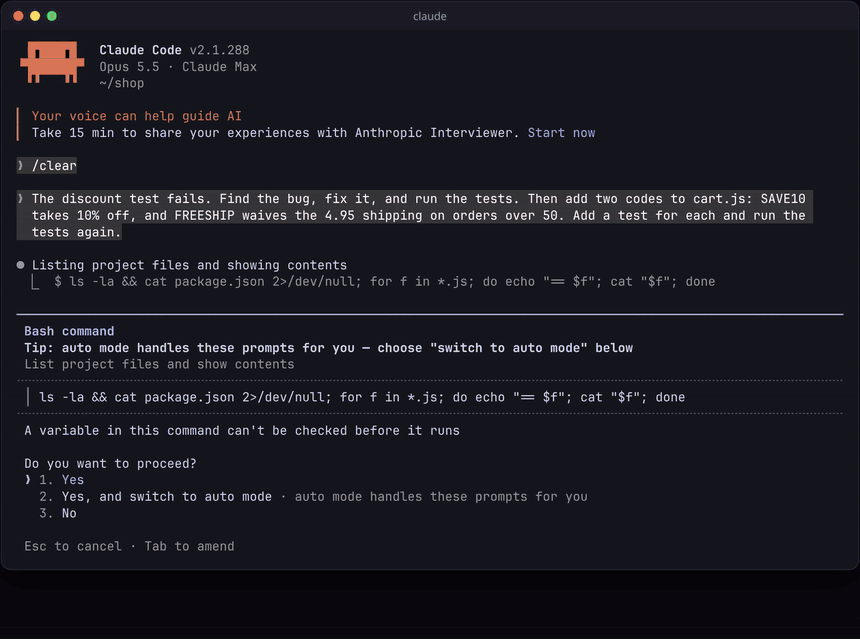
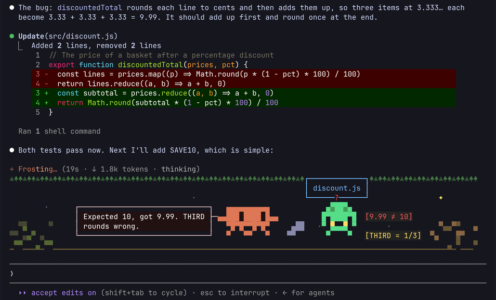

# clawd-cartoons

A Claude Code mod that adds a live cartoon under the spinner, drawn by Sonnet while the agent works.

While Claude works, a strip under the spinner line shows Clawd, the coral Claude Code mascot, acting out and narrating each step like a comic strip. Clawd reads the files off a shelf, chases the bug the test just caught, and cheers when the tests go green. Each line names the real file, test or result: "Cat-ing every shelf. Test says 9.99, wanted 10. Someone rounded badly."

Each panel is written by Sonnet 5.5 as a few layers, pixel-art props and a little program. It runs at 20 frames a second in a sandboxed interpreter inside the mod.



Inspired by [Anshu's tweet](https://x.com/anshuc/status/2105773281936650247) (@anshuc), which showed the idea: "I vibe-coded my own spinner that watches what the main agent is doing and uses Sonnet 5.5 to turn it into little cartoons in real time". Anshu didn't share the code, so this is an independent implementation written from the Claude Code mod docs. Thanks for the idea!

## Install

In Claude Code:

```
/plugin marketplace add falkoro/clawd-cartoons
/plugin install clawd-cartoons@clawd-cartoons
```

Cartoons start with your next turn. Clawd shows up as soon as the turn starts, walking along and saying what the agent is doing. The first drawn panel follows a few seconds later.

To try a checkout without installing it: `claude --plugin-dir plugins/clawd-cartoons`.

## Configure

Open `/plugin`, pick clawd-cartoons, and change any of these:

| Option | Default | What it does |
| --- | --- | --- |
| Draw cartoons (`enabled`) | on | Off gives you the normal spinner and makes no model calls |
| Model (`model`) | `claude-sonnet-5-5` | The model that draws scenes: an alias such as `sonnet` or `haiku`, or a full model id |
| Seconds between requests (`min_seconds_between_requests`) | 10 | The shortest gap between two requests for a new panel |
| Scene height (`scene_rows`) | 8 | Rows of cartoon under the spinner, 4 to 16 |
| Reply token limit (`max_reply_tokens`) | 16000 | The most tokens one panel may use |
| Effort (`effort`) | low | How hard the model thinks about each scene |

The `/cartoons` command shows what the mod has done this session: the requests, how many of them only changed Clawd's line, the tokens used and the last error. It also takes these arguments:

- `/cartoons off` turns cartoons off for the rest of the session.
- `/cartoons on` turns them back on.

## How it works

1. **Watching.** The mod listens to what the agent does and says:
   - `prompt.submit` and `turn.start` give it what you asked for.
   - `tool.call` gives it each step, such as "running npm test" or "reading discount.ts", and the start and end of what that step returned, including whether it failed.
   - `session.append` gives it the main agent's own words, such as "Found the bug: discountedTotal rounds each line…".
2. **Asking.** After each step, the mod asks the model for the next panel. The request carries the step, what it returned, what the agent just said, and the story so far (the last four panels' captions and lines), so each panel follows from the one before.
   - Requests are debounced by 1.2 s, so a burst of tool calls makes one request.
   - Requests are at least `min_seconds_between_requests` apart. Steps that come in while a panel is being drawn get the next one.
   - Nothing is asked when nothing new has happened, or between turns.
   - After an API error, requests back off from 30 s, doubling up to 10 minutes.
   - The call goes through `$.model.complete`, using the session's own credentials.
3. **Keeping or redrawing.** When the scene on screen still fits the step, the model replies `{"keep": true, "say": …}`. Clawd's line changes and the drawing stays. Otherwise it draws a new scene.
4. **Checking.** The reply is parsed, and a new scene runs for a few test frames before it is shown. A scene that crashes or runs out of steps is never shown. Its error is sent back to the model with the next request.
5. **Drawing.** The Spinner render site (`ui.render` on `Spinner`) keeps the normal spinner line and adds a `Raster` below it.
   - A 50 ms timer draws each frame and repaints the Raster in place with `$.ui.blit`, without re-rendering the transcript.
   - A new line types out in the speech bubble, and the bubble steps aside rather than cover Clawd.
   - The terminal is the only surface with a Raster. On the desktop, and when cartoons are off, the spinner is left alone.

Nothing is saved between turns or sessions: every panel is drawn for the step it shows.



### What a scene is

The model replies with a JSON block and, usually, a program:

````
```json
{
  "caption": "running the tests by the campfire",
  "sky": ["#0b1026", "#2a1830"],
  "ground": { "color": "#4a3a2a", "glyph": "▁" },
  "particles": [{ "glyph": "·", "color": "#8fa3ff", "count": 14, "vx": -1, "vy": 0 }],
  "actors": [
    { "clawd": true, "x": 2, "vx": 3, "wrap": false },
    { "pix": ["..RR..", "RRRRRR", ".W..W."], "palette": { "R": "#e05050", "W": "#dddddd" },
      "label": "discount.test.ts", "x": 40, "y": 5, "vx": -4 }
  ],
  "say": { "text": "discount.test.ts fails. The rounding again.", "x": 18, "y": 0 }
}
```
```js
function draw(t) { /* paint the fire */ }
```
````

Layers draw in this order:

1. sky gradient
2. ground row
3. drifting particles
4. **the program**
5. sliding actors: Clawd (who walks and blinks on its own), ASCII art, or pixel art from `pix` rows and a `palette`, each with an optional `[label]` tag above it
6. the speech bubble

In the bubble, `{doing}` becomes the current step, such as "running npm test".

A reply that keeps the scene is only the line:

```json
{ "keep": true, "say": { "text": "discount.test.ts is green. The bug left in a tow truck.", "x": 1, "y": 0 } }
```

### The scene language

Programs are written in a small subset of JavaScript and run by a tree-walking interpreter in [`hooks/lang.ts`](plugins/clawd-cartoons/hooks/lang.ts). Mods can't `eval`, and running model-written code in a separate process would be unsafe. An interpreter can be stopped at any step and can only reach what it is given.

**Supported:**
- `let`, `const` and `var`; functions and arrows with default parameters
- `if`, `for`, `for…of`, `for…in`, `while`, `do`, `switch`, `break`, `continue` and `return`
- objects with shorthand and methods, arrays, template strings, and flat destructuring
- the usual operators
- whitelisted array and string methods
- `Math` (with a seeded `random`), `Array.from`, `Object.keys`/`values`/`entries`, `String`, `Number`, `parseInt` and `parseFloat`

**Not supported:** `new`, classes, `this`, `try`/`throw`, async code, regex, spread, `?.` and imports. Each of these gets an error message that suggests what to write instead.

**How a program runs:**
- Top-level code runs once.
- After that, `draw(t)` runs every frame. A program with no `draw` re-runs whole each frame.
- Globals: `W`, `H`, `t`, `frame`, and `doing` (the current step as text).

**Drawing**, in cells where x grows right and y grows down:

| Call | Draws |
| --- | --- |
| `put(x, y, ch, fg?, bg?)` | one cell |
| `text(x, y, str, fg?, bg?)` | a line of text |
| `sprite(x, y, "multi\nline", fg?, bg?)` | ASCII art; spaces are see-through |
| `fill(x, y, w, h, bg?, ch?, fg?)` | a rectangle |
| `line(x0, y0, x1, y1, ch?, fg?)` | a line |
| `circle(x, y, r, ch?, fg?)` | an outline |
| `disc(x, y, r, color)` | a solid disc in half-cell pixels, so it looks round |
| `pixel(x, py, color)` | one half-cell pixel; `py` counts half rows |
| `art(x, y, rows, palette)` | pixel art: one character per pixel, two pixel rows per cell, colors from the palette; `.` and spaces are see-through |
| `tag(x, y, label, fg?, bg?)` | a `[label]` tag, for naming a prop after a file, test or function |
| `clawd(x, y, facing, stride, blink)` | Clawd |
| `say(text, x, y)` | a speech bubble |

Every cell takes its own foreground and background color, so a program can paint full shaders.

Helpers: `hsl`, `rgb`, `mix`, `noise`, `noise2`, `smoothstep`, `rand` and `clamp`.

Only one-cell-wide characters are drawn. Emoji and other wide characters become `?`, so the terminal grid never breaks.

## Safety model

The model writes code after seeing what your agent is doing, so that code is treated as untrusted.

- **No eval and no processes.** The program is parsed and walked by the interpreter. It never becomes JavaScript the host runs, and no child process is started.
- **Nothing to reach.** A program sees only its own values and the functions listed above.
  - Property reads return only an object's own data, so `constructor`, `__proto__` and prototypes give `undefined`.
  - Functions have no properties, and methods can't be taken off and stored.
  - Assigning to a built-in only shadows it for that program.
- **A step budget.** Every statement and expression costs a step, and drawing costs a step per cell touched.
  - One frame gets 300,000 steps; setup gets 1,000,000. Going over stops the program with an error.
  - This catches infinite loops and runaway work.
- **Memory bounds.**
  - Arrays are capped at 10,000 items and strings at 10,000 characters.
  - One frame may create at most 200,000 items and characters.
  - Calls may nest at most 64 deep, which catches unbounded recursion.
  - A program that keeps creating things re-runs its setup instead of growing forever.
- **Errors go back to the model.** A scene that fails is switched off. The error, as `line N: message`, is sent with the next request so the model can fix it.
- **Cheap frames.** A full-width shader covering every cell of a 200 × 8 strip takes about 1–2 ms a frame on Node 26 (see the timing test in `tests/scene.test.ts`). A frame at 20 fps has 50 ms.

**Privacy:** each request sends the model a few short pieces of text:
- the current step, such as a command line or a file name, and the last few steps
- the first 300 characters of your latest prompt
- the first 400 characters of what the agent last said
- up to 300 characters of what the last step returned, from its start and its end. When the step read a file or ran a command, that can be part of the file or of the command's output.
- the story so far: the captions and lines of the last four panels

They go through Claude Code's own API client, under the same account and model terms as the rest of your session.

## Cost

Each panel is one request. In the demo above, a 24 s turn made 3 requests, with about 3,400 input tokens (mostly the fixed instructions) and 800 output tokens each. `max_reply_tokens` caps each reply.

What keeps the cost down:
- **At most one request every 10 seconds** while Claude works, and none between turns or when nothing new has happened.
- **Kept scenes are short.** When the scene still fits, the reply is one line of JSON instead of a new drawing.
- **Seeing what was spent:** `/cartoons` shows this session's requests and tokens.

**To spend less**, any of these helps:
- pick a cheaper model, such as `haiku`
- raise the seconds between requests

**To spend nothing**, do any of these:
- turn off "Draw cartoons" in `/plugin`
- run `/cartoons off` for the current session
- disable the plugin entirely in `/plugin`, or with `claude plugin disable clawd-cartoons`

## Develop

```
claude plugin validate plugins/clawd-cartoons --strict
claude plugin test plugins/clawd-cartoons
```

The tests cover:
- the interpreter: budgets, recursion, memory limits, bad programs, and the sandbox
- every drawing primitive and the Raster encoding
- reply parsing
- the mod against a stubbed engine: Clawd's first scene, debouncing, the request gap, a panel per step, kept scenes, what goes with each request, error feedback, backoff, `/cartoons` and the options

CI runs the same commands.

## Contributing

Feature requests and pull requests are welcome. Open an issue with an idea for a scene, a step Clawd acts out badly, or a bug. A screenshot of the panel helps.

For a pull request, run `claude plugin test plugins/clawd-cartoons` and `claude plugin validate plugins/clawd-cartoons --strict` first. CI runs the same two commands. A prompt change is easiest to judge with before-and-after screenshots of a panel from a real session.

## License

MIT. The Clawd here is pixel art drawn for this mod after the Claude Code banner mascot.
